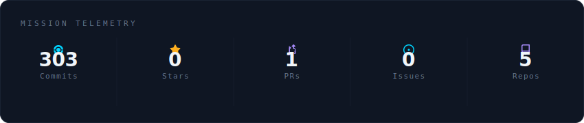

<!-- Personalized GitHub Profile README -->

  

 

  

 

  

 

  

 

<strong>More about me</strong>

 

AI & Automation Engineer and Data Science & AI undergrad at PUCRS — incoming exchange student in Informatik at the **University of Tübingen** (winter semester 2026/27, coursework: Deep Learning & Reinforcement Learning).

I build AI agents and automations that take repetitive work out of the way, and I like proving the impact with numbers: AI assistants serving 30+ healthcare congresses (3× faster responses, human handoffs down from 20% to 8%), plus ML work in student-dropout prediction and medical-image classification.

**Based in** Porto Alegre, Brazil → **Tübingen, Germany** from October 2026

 

  
  

